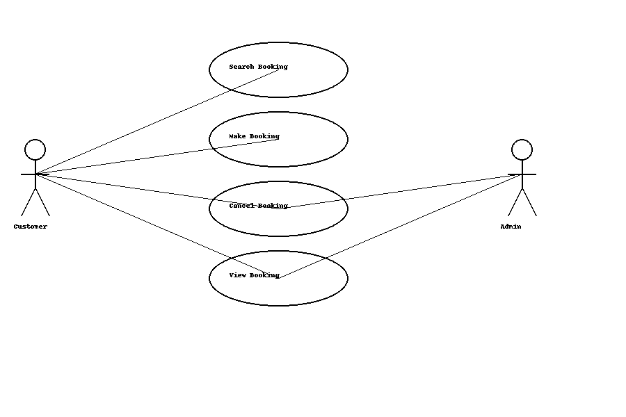

# Requirement Analysis in Software Development  

## 📖 Introduction  
This repository is dedicated to documenting the **Requirement Analysis** phase of software development. It serves as a structured reference for understanding how project needs are gathered, analyzed, and transformed into detailed documentation and diagrams.  

The purpose of this repository is to:  
- Provide a hands-on example of requirement analysis for a **Booking Management System**.  
- Demonstrate how to define **functional and non-functional requirements**.  
- Show how to use diagrams to represent **system actors and interactions**.  
- Establish **acceptance criteria** that align with user and business goals.  

This project is part of a learning exercise to apply industry-standard practices in requirement analysis, ensuring clarity, structure, and precision in software development.  
## 🔑 Why is Requirement Analysis Important?  

Requirement Analysis is a cornerstone of the Software Development Life Cycle (SDLC) because it ensures the project starts with a clear direction and understanding. Its importance lies in the following:  

1. **Prevents Miscommunication**  
   - By clearly documenting requirements, all stakeholders (clients, developers, testers, and project managers) share the same understanding of the system. This reduces confusion and aligns everyone toward the same goal.  

2. **Saves Time and Cost**  
   - Identifying requirements early helps avoid costly redesigns or fixes later in development. A well-done requirement analysis reduces the risk of rework and project delays.  

3. **Defines Clear Success Criteria**  
   - Requirement analysis establishes measurable acceptance criteria, ensuring that the final product can be validated against user and business needs. This provides a benchmark for project success.  
## 📌 Key Activities in Requirement Analysis  

Requirement Analysis consists of several structured activities that help in identifying, documenting, and validating requirements. The five key activities are:  

- **Requirement Gathering**  
  - Collecting information from stakeholders, users, and existing systems to understand the project’s goals and expectations.  
  - Helps ensure all relevant needs are captured before moving forward.  

- **Requirement Elicitation**  
  - Engaging with stakeholders through interviews, questionnaires, workshops, and observation.  
  - Focuses on uncovering hidden needs and clarifying vague requirements.  

- **Requirement Documentation**  
  - Organizing requirements into a structured form (e.g., Software Requirement Specification - SRS, or in this project, the README.md).  
  - Documentation ensures requirements are available for reference throughout the SDLC.  

- **Requirement Analysis and Modeling**  
  - Analyzing requirements to detect conflicts, redundancies, or ambiguities.  
  - Creating models and diagrams (like **use case diagrams**) to represent system behavior and interactions
## 📂 Types of Requirements  

In software development, requirements are broadly categorized into **Functional** and **Non-functional** requirements. Both play a critical role in ensuring the system works as expected and meets user needs.  

### ⚙️ Functional Requirements  
Functional requirements describe **what the system should do** – the core features and capabilities of the application. They define interactions between the system and its users.  

**Examples for the Booking Management System:**  
- Users should be able to **create accounts** and **log in**.  
- The system should allow users to **search for available bookings**.  
- Users should be able to **make, edit, or cancel bookings**.  
- The system should **send booking confirmations via email/SMS**.  
- Admins should be able to **manage users, bookings, and availability**.  

### 🛡️ Non-functional Requirements  
Non-functional requirements describe **how the system performs its functions**. They define quality attributes such as performance, security, usability, and reliability.  

**Examples for the Booking Management System:**  
- The system should be available **24/7** with at least **99% uptime**.  
- Average search response time should be **under 2 seconds**.  
- User data must be **encrypted** and protected against unauthorized access.  
- The system should support both **desktop and mobile devices**.  
- The interface should be **intuitive, user-friendly, and accessible** (WCAG compliant).  
## 🎨 Use Case Diagrams  

**Use Case Diagrams** are a type of UML (Unified Modeling Language) diagram that illustrate how users (actors) interact with a system to achieve specific goals.  

### 📌 Benefits of Use Case Diagrams  
- Provide a **visual overview** of system functionality.  
- Help identify **actors** (users, admins, external systems) and their interactions with the system.  
- Simplify communication between stakeholders, developers, and designers.  
- Serve as a reference point for **requirement validation**.  

### 📂 Booking Management System – Use Case Diagram  
The diagram below shows the primary actors and their interactions with the booking system.  

**Actors:**  
- **User** – Creates accounts, logs in, makes/cancels bookings, views booking history.  
- **Admin** – Manages bookings, user accounts, and system availability.  
- **System** – Sends confirmations and notifications.  

  
